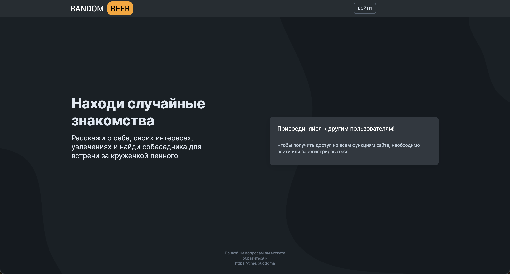
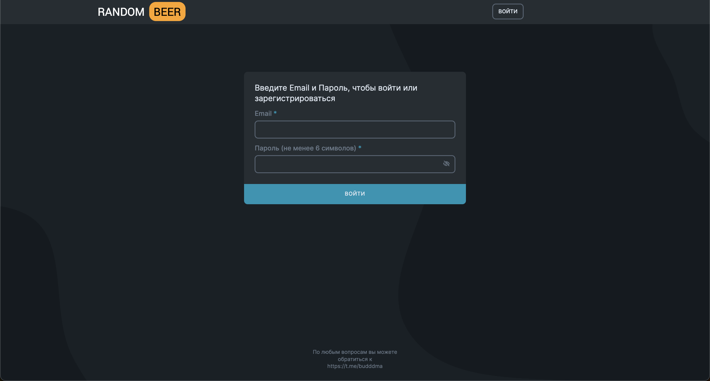
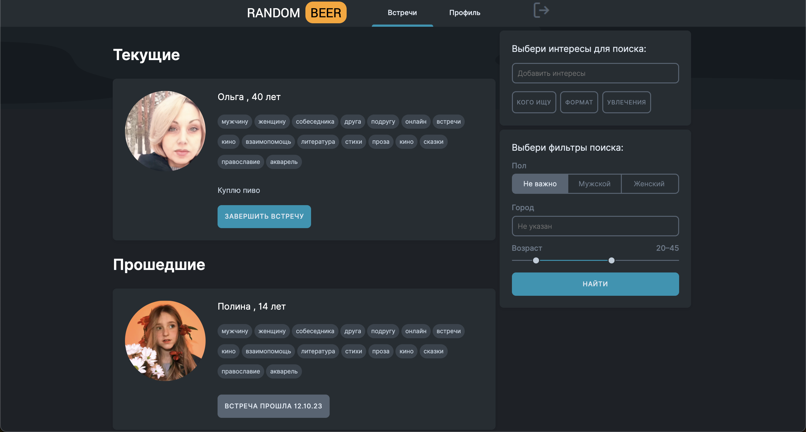
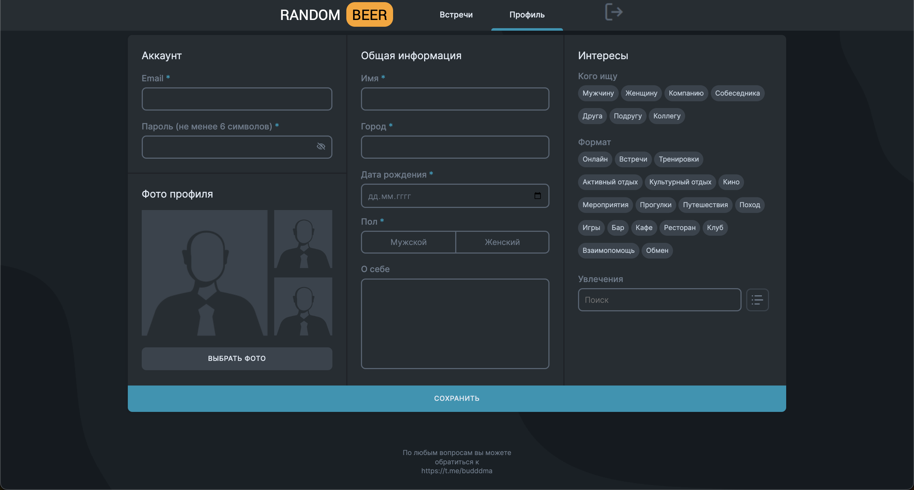

#### "Random Beer" - сервис по поиску собеседника со следующим функционалом:
- Авторизация пользователей, заполенение и редактирование анкеты о себе про свои персональные цели сферу деятельности, интересы, свободное время и предпочтительное место встреч, предпочтения по собеседникам;
- Мэтчинг случайных пользователей на основе их предпочтений, создание пары для встречи за кружкой пенного и сохранение истории мэтчингов, чтобы не повторяться;

#### Скриншоты

#### Инструкция по запуску фронтенда
1. `cd frontend`
2. `npm install`
3. `npm start`

#### Инструкция по запуску бэкенда
1. `cd backend`
2. `source env/bin/activate`
3. `pip install -r requirements.txt`
4. `./manage.py runserver`